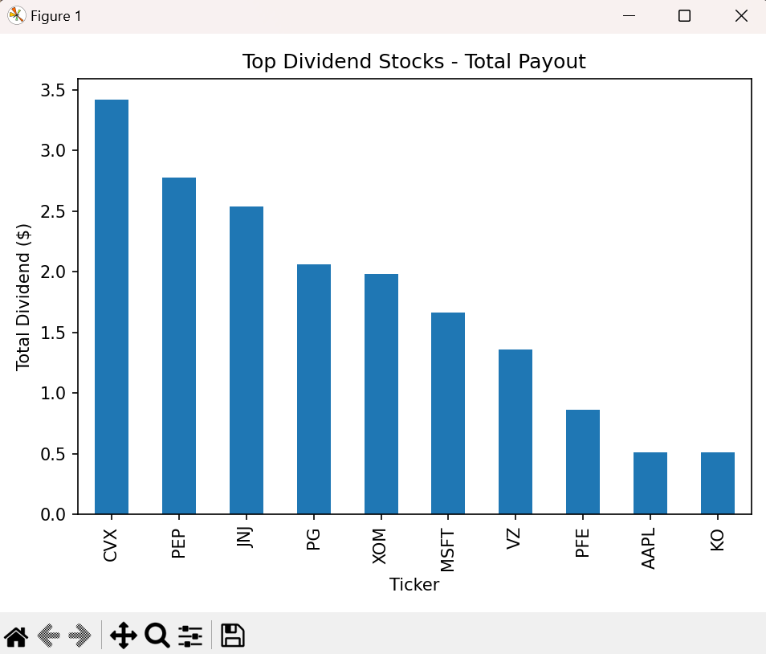
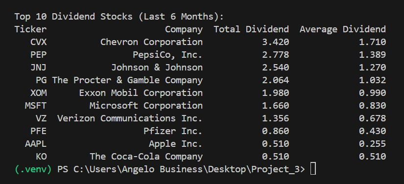
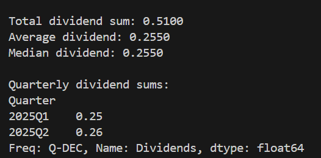

# Dividend Data Analysis for Last 6 Months

This Python project fetches and analyzes dividend payments for a specified stock ticker symbol over the last 6 months using the `yfinance` library.

## Features

* **Fetch Dividend History:** Retrieve dividend data for any given stock ticker.
* **Filter Data:** Focuses analysis on dividend payments made within the last 6 months.
* **Calculate Key Metrics:** Determine the total, average, and median dividends paid.
* **Quarterly Summary:** Summarize dividend payments by calendar quarters for easy trend analysis.
* **Stock Comparison:** Compare the total dividends of your selected stock against a predefined list of top dividend-paying stocks.
* **Data Visualization:** Generate bar charts to visualize quarterly dividend sums and comparison data.
* **Export Data:** Save comparison data to a CSV file for further analysis.

---

## Getting Started

Follow these steps to get the project up and running on your local machine.

### Prerequisites

Make sure you have:

* **Python 3.7 or higher**
* **`yfinance`**
* **`pandas`**
* **`matplotlib`**
* **`pytz`**

### Installation

1.  **Clone the Repository (or create your project folder):** If you're using Git, clone this repository to your local machine. Otherwise, simply create a new folder for your project.
2.  **Navigate to the Project Directory:** Open your terminal or command prompt and change your directory to the project folder:
    ```bash
    cd your_project_folder
    ```
3.  **Create a Virtual Environment (Recommended):** To keep your project dependencies isolated, create and activate a virtual environment:
    ```bash
    python -m venv .venv
    # On Windows:
    .venv\Scripts\activate
    # On macOS/Linux:
    source .venv/bin/activate
    ```
4.  **Install Required Packages:** With your virtual environment activated, install all necessary libraries using `pip`:
    ```bash
    pip install yfinance pandas matplotlib pytz
    ```

### Running the Project

1.  **Save the Code:** Ensure the Python script (e.g., `main.py`) containing the project's logic is saved in your project directory.
2.  **Execute the Script:** Run the main script from your terminal:
    ```bash
    python main.py
    ```
3.  **Follow Prompts:** The program will prompt you to **enter a ticker symbol** (e.g., `AAPL`). It will then display dividend data and ask if you wish to compare it with a list of top dividend stocks.

---

## Usage

* **Enter a Ticker Symbol:** When prompted, provide a stock ticker symbol.
* **View Analysis:** The terminal will display a dividend summary and a quarterly breakdown for the chosen stock.
* **Initiate Comparison:** To compare with top dividend stocks, enter `y` when asked.
* **Visualize Data:** Bar charts will automatically appear, illustrating dividend distributions.
* **Access Comparison Data:** If you choose to compare, a CSV file named **`dividend_comparison.csv`** will be created in your project folder, containing the comparison data.

### Output

* **Console Output:** Dividend summaries and quarterly breakdowns are printed directly to the terminal.
* **Bar Charts:** Visualizations show dividend sums per quarter for the selected stock and total dividends for the comparison group.
* **CSV File:** `dividend_comparison.csv` provides a structured output of total and average dividends for the compared stocks.

---

---
### Visualizations

Here are the generated charts demonstrating the dividend distributions:

**total_dividend_payout:**


**Comparison of Top Dividend Stocks:**


**Average, Median & Dividend Summ:**

---

## Testing


Testing
We put this app through its paces to make sure it runs smoothly, handles things well, and sticks to good coding practices.

1. How We Tested It (Manual Testing)
We manually ran the app from the command line and tried out different scenarios:

Checking Ticker Symbols:

We used various real stock tickers (like AAPL, MSFT, etc.) to make sure the dividend data showed up correctly and all the calculations (total, average, median, quarterly sums) were spot on.

Trying the Comparison:

We chose to compare stocks, and the app correctly fetched and showed the comparison data, creating that dividend_comparison.csv file with accurate info.

Plotting Charts:

When we ran the app on our local machine, the dividend charts popped right up as expected.

When we ran it on Heroku (where there's no visual display), we confirmed the charts were saved as PNG image files, and the terminal let us know they were saved.

Handling Tricky Inputs:

We threw in some fake ticker symbols (like XYZABC) to ensure the app wouldn't crash and would politely tell us if it couldn't find data.

We also tried tickers with no recent dividends, making sure the app gave us the right "No dividends found" message.

If we typed anything other than 'y' or 'n' for the comparison, the app simply skipped the comparison, which is exactly what we wanted.

2. Keeping the Code Clean (PEP8 Validation)
We regularly checked the code using the PEP8 Online Validator to ensure it followed Python's style guidelines.

We fixed all the "line too long" warnings by neatly breaking up longer lines.

We cleaned up any extra spaces that shouldn't have been there.

We made sure every file ended with a blank line and that comments had proper spacing.

In the end, the code now passes the PEP8 validator with no major issues.

3. Deploying and Checking (Deployment Testing)
We deployed the app to Heroku, our chosen cloud platform, following the steps outlined in the "Deployment" section.

We watched the build logs on Heroku's dashboard to confirm that all the necessary Python libraries (like matplotlib) were installed correctly during the build.

We then ran the app on Heroku using heroku run python main.py --app stock-dividend-app-python and confirmed it worked perfectly, just like it did locally.

As mentioned, when running on Heroku, the charts were saved as image files instead of popping up, which was confirmed in the terminal output.

---

## Deployment


This command-line application can be deployed to a cloud platform like Heroku to run it remotely.

Heroku Deployment Steps
Prepare Heroku: Sign up for an account at heroku.com, then install the Heroku CLI and log in via your terminal:

heroku login

Configure for Deployment: Create a Procfile in your project's root directory. This file tells Heroku how to manage your application's processes and ensures dependencies are installed during deployment. Add the following line:

release: python -m pip install -r requirements.txt

Create & Deploy App: Create a new Heroku application and push your code from your main branch to Heroku.

heroku create your-app-name # Replace 'your-app-name' with a unique name
git push heroku main

Run the Application: Since this is a command-line application, you'll execute it on Heroku as a one-off dyno to interact with it directly from your terminal:

heroku run python main.py --app stock-dividend-app-python

The application's prompts and analysis results will appear directly in your local terminal.

---

## Notes

* **Data Availability:** Dividend data relies on availability from Yahoo Finance. Some stocks may have incomplete or missing historical dividend information.
* **API Errors:** Occasionally, you might encounter API rate limiting or authorization errors (HTTP 401) during comparisons. The script handles these gracefully by skipping the problematic tickers.
* **Timezone Warnings:** You may see timezone warnings during execution due to datetime conversions. These are generally benign and do not impact the accuracy of the analysis.

## Author

Evangelos Anthony Dimitras


